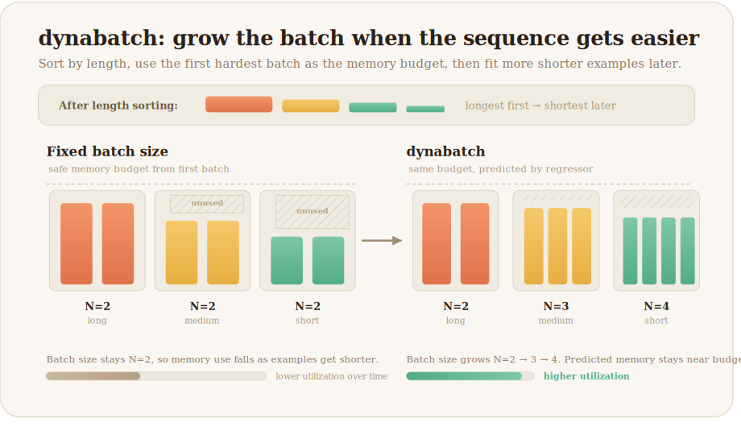
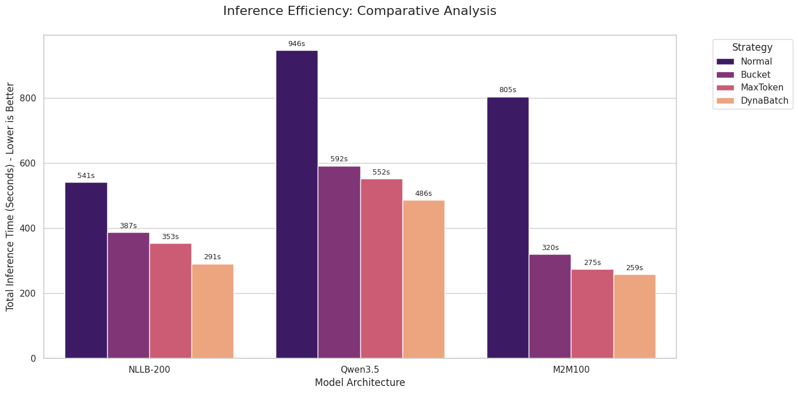
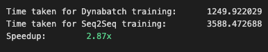

# dynabatch
[](https://pypi.org/project/dynabatch/)
[](https://pypi.org/project/dynabatch/)
[](LICENSE)
[](https://github.com/bendangnuksung/dynabatch/actions/workflows/test.yml)

**Use more of your GPU on variable-length text generation.**

Long inputs force small safe batches. Later, shorter inputs could often fit more examples, but most loaders keep using the same conservative batch size. `dynabatch` grows those later batches automatically.

<p align="center">
  
</p>

`dynabatch` is a drop-in PyTorch batch sampler for variable-length text workloads. It starts with max-token-style length sorting, then uses a pre-trained regressor to increase batch size on easier, shorter batches while keeping predicted memory pressure below the first, hardest batch.

## Quick Start

Install:

```bash
pip install dynabatch
```

Use it as a `DataLoader` batch sampler. Omit `batch_size` from `DataLoader`; the sampler controls batch sizes.

```python
from datasets import Dataset
from torch.utils.data import DataLoader
from transformers import AutoTokenizer
from dynabatch import dynabatch_sampler

texts = [
    "Hello world!",
    "This is a slightly longer example sentence for batching.",
    "Short one",
    "A much longer sentence is useful to create variable sequence lengths for testing dynabatch quickly.",
    "A much longer sentence is useful to create variable sequence lengths for testing dynabatch quickly, A much longer sentence is useful to create variable sequence lengths for testing dynabatch quickly",
    "Another medium-length sample.",
    "Tiny",
]

dataset = Dataset.from_dict({"text": texts})
tokenizer = AutoTokenizer.from_pretrained("google/flan-t5-small")

def collate_fn(batch):
    batch_texts = [x["text"] for x in batch]
    return tokenizer(batch_texts, padding=True, truncation=True, return_tensors="pt")

sampler = dynabatch_sampler(texts, tokenizer, batch_size=1, max_input_token_length=64)
loader = DataLoader(dataset, batch_sampler=sampler, collate_fn=collate_fn)

for i, batch in enumerate(loader):
    print(f"Batch No: {i} | Batch size: {len(batch['input_ids'])}")
```

Or use `build_dynabatch_dataloader(texts, tokenizer, batch_size=1, max_input_token_length=64)` for a built-in loader.

## Results

These are workload-specific results, not a universal speedup claim. `dynabatch` helps most when variable sequence lengths leave memory headroom unused.

| Workload | Hardware | Baseline | dynabatch | Notebook | Notes |
|---|---:|---|---:|---|---:|
| Inference `generate()` | Colab T4 | max-token sampler | **1.06×-1.21×** | [inference Colab](https://colab.research.google.com/github/bendangnuksung/dynabatch/blob/main/notebooks/dynabatch_inference_comparison.ipynb) | Smaller gain: T4 has less compute headroom, so larger batches help less |
| Seq2Seq training | RTX 5090 | fixed batch | **3.3×** | [training notebook](https://github.com/bendangnuksung/dynabatch/blob/main/notebooks/dynabatch_training_comparison.ipynb) | Larger gain: the 5090 has much more compute headroom, so growing shorter batches improves utilization |

1. [Inference `generate()`](https://colab.research.google.com/github/bendangnuksung/dynabatch/blob/main/notebooks/dynabatch_inference_comparison.ipynb)
<p align="center">
  
</p>


2. [Seq2Seq training](https://github.com/bendangnuksung/dynabatch/blob/main/notebooks/dynabatch_training_comparison.ipynb)
<p align="center">
  
</p>

## Should You Use It?

Use `dynabatch` if:

- you run encoder-decoder generation or training, especially translation-style workloads
- input lengths vary a lot
- a few long examples force a small safe batch size
- shorter examples later in the dataset leave GPU memory or compute underused

Probably skip it if:

- you are using decoder-only LLMs where sequence packing is the better first optimization
- your workload is already compute-bound at the smallest safe batch size
- input length is a poor proxy for generation cost

To sanity-check your workload, compare `dynamic_batch_mode=True` against `dynamic_batch_mode=False`. If both behave similarly, batching is probably not your bottleneck.

## ➕ More Examples

### Compare dynamic vs static batching
```python
from torch.utils.data import DataLoader
from dynabatch import dynabatch_sampler

kw = dict(texts=texts, tokenizer=tokenizer, batch_size=32, max_input_token_length=256)
dynamic = DataLoader(
    dataset,
    batch_sampler=dynabatch_sampler(**kw, dynamic_batch_mode=True),
    collate_fn=collate_fn,
)
static = DataLoader(
    dataset,
    batch_sampler=dynabatch_sampler(**kw, dynamic_batch_mode=False),
    collate_fn=collate_fn,
)
```

`dynamic_batch_mode=False` behaves like Max Token Sampler/Batching without the regressor-driven dynamic resizing. In other words, dynabatch is:

- Max Token Sampler/Batching
- plus optional dynamic batch growth on top

That makes `dynamic_batch_mode=False` useful as a sanity check.

### OOM-safe generation with fallback splitting

The regressor is empirical, so it can still occasionally predict a batch size that turns out too aggressive for a specific model, prompt template, GPU state, or generation setting. `generate_with_oom_fallback()` lets you keep the run alive by splitting only the failed batch into smaller chunks.

```python
import torch
from torch.utils.data import DataLoader
from dynabatch import dynabatch_sampler, generate_with_oom_fallback

loader = DataLoader(
    dataset,
    batch_sampler=dynabatch_sampler(texts, tokenizer, batch_size=32, max_input_token_length=256),
    collate_fn=collate_fn,
)
device = torch.device("cuda")

with torch.inference_mode():
    for batch in loader:
        generated_tokens, did_fallback = generate_with_oom_fallback(
            model, batch, min_batch_size=32, device=device, max_new_tokens=128,
        )

        if did_fallback:
            print("Fallback path used for this batch after an OOM.")
```

This is useful when you want throughput from dynamic batching without letting one occasional OOM kill a long inference run.

### Training-style usage

For training:

- if you want hardware friendly sizes (`2^n` or `3 * 2^n`), enable `friendly_batch_size=True`
- if you want to avoid odd batch sizes, keep `keep_batch_size_even=True` (default)
- if you want shuffled batches, set `shuffle=True`
- `shuffle_keep_first_n=3` means the first 3 hardest batches stay unshuffled and only the later batches are shuffled
- keeping the earliest hardest batches fixed is useful because it lets you hit the worst memory cases early and find OOM problems sooner

```python
from torch.utils.data import DataLoader
from dynabatch import dynabatch_sampler

train_loader = DataLoader(
    dataset,
    batch_sampler=dynabatch_sampler(
        texts,
        tokenizer,
        batch_size=16,
        max_input_token_length=256,
        friendly_batch_size=True,
        shuffle=True,
        shuffle_keep_first_n=3,
    ),
    collate_fn=collate_fn,
)
```

### Hugging Face Trainer integration (plug-and-play)

If you train with Hugging Face `Trainer`, use the trainer helpers so you do not have to manually inject:

- `get_train_dataloader()` override for `batch_sampler`
- `compute_loss()` reweighting for variable micro-batch sizes under gradient accumulation

```python
from transformers import Seq2SeqTrainer # Seq2SeqTrainer  as
from dynabatch import (
    dynabatch_sampler,
    make_dynabatch_trainer,
    MemoryCleanupCallback,
)

sampler = dynabatch_sampler(
    texts=train_texts,
    tokenizer=tokenizer,
    batch_size=8,
    max_input_token_length=512,
    shuffle=True,
)

DynabatchSeq2SeqTrainer = make_dynabatch_trainer(Seq2SeqTrainer)

trainer = DynabatchSeq2SeqTrainer(
    dynabatch_sampler=sampler,
    model=model,
    args=training_args,
    train_dataset=train_dataset,
    eval_dataset=eval_dataset,
    data_collator=data_collator,
    callbacks=[MemoryCleanupCallback()],
)
```

When this is a good fit:

- You use a Hugging Face trainer class and want dynamic batching without custom trainer boilerplate.
- `gradient_accumulation_steps > 1` and micro-batch sizes vary by step.
- You want fairer baseline-vs-dynabatch comparisons where fewer dynabatch steps can otherwise change the effective LR schedule.

Why loss reweighting exists:

- With variable micro-batch sizes, a plain accumulated loss can bias optimizer updates toward steps with smaller/larger batch sizes.
- Dynabatch rescales each micro-batch by `current_batch_size / per_device_train_batch_size` so contribution is closer to sample-count-weighted behavior.

When to enable LR auto-scaling (Off by default):

- You are comparing against an older fixed-batch trainer/collator setup and want similar effective optimization signal per epoch.
- DynaBatch significantly reduces steps-per-epoch and you want a linear-scaling-style correction.

```python
trainer = DynabatchSeq2SeqTrainer(..., auto_scale_lr=True)
```

Power-user options:

- Use `DynabatchTrainerMixin` directly if you need custom multiple inheritance:
  `class MyTrainer(DynabatchTrainerMixin, Seq2SeqTrainer): ...`
- Use `scale_lr_for_dynabatch(args, sampler, dataset_size)` as a standalone helper if you want explicit LR control outside trainer construction.
- For non-text modalities, set `batch_size_key=...` (for example `"pixel_values"`) so batch-size extraction in `compute_loss()` reads the right tensor.

OOM fallback options:

- `oom_fallback="split_retry"`: on `torch.cuda.OutOfMemoryError` during `training_step`, retry the same step in smaller chunks and keep as many samples as possible.
- `oom_fallback="skip"`: clear memory and skip the failing step by returning a zero loss.
- `oom_fallback=None`: (default) disable fallback and re-raise OOM immediately.
- `oom_min_batch_size`: chunk size used by split-retry. If unset, the trainer uses `dynabatch_sampler.min_batch_size`.
- Every handled OOM increments an `oom_failed` counter and logs it via `Trainer.log(...)`, so it appears in Trainer/TQDM progress metrics.

```python
trainer = DynabatchSeq2SeqTrainer(
    ...,
    oom_fallback="split_retry",  # "split_retry" | "skip" | None
    oom_min_batch_size=2,
)
```


## API

### `dynabatch_sampler`

Returns a `DynaBatchSampler` for `DataLoader(..., batch_sampler=sampler)`. The dataset indices must match `texts`.

```python
dynabatch_sampler(
    texts: list[str],
    tokenizer: PreTrainedTokenizerBase,
    batch_size: int,
    max_input_token_length: int = 512,
    **kwargs,
) -> DynaBatchSampler
```

### `build_dynabatch_dataloader`

Same batching as `dynabatch_sampler`, but returns a `DataLoader` with built-in tokenizer collation.

```python
build_dynabatch_dataloader(
    texts: list[str],
    tokenizer: PreTrainedTokenizerBase,
    batch_size: int,
    max_input_token_length: int = 512,
    **tokenizer_kwargs,
) -> DataLoader
```

Common options:

| Option | Why you might change it |
|---|---|
| `batch_size` | Set this to the largest safe batch size for your longest inputs. |
| `threshold` | Lower it for more conservative dynamic growth; `1.0` means roughly as memory-heavy as the first batch. |
| `max_batch_range` | Caps how much larger later batches can get relative to `batch_size`. |
| `dynamic_batch_mode` | Turn off to compare against max-token batching without regressor-driven resizing. |
| `shuffle` / `shuffle_keep_first_n` | Shuffle built batches while keeping the first hardest batches fixed for early OOM detection. |
| `friendly_batch_size` | Round chosen batch sizes to hardware-friendly values like powers of two. |
| `token_lengths`, `word_lengths`, `char_lengths` | Provide precomputed lengths to skip the upfront length pass. |

### Trainer helpers

```python
make_dynabatch_trainer(trainer_cls: type) -> type
scale_lr_for_dynabatch(
    args: Any,
    sampler: DynaBatchSampler,
    dataset_size: int,
    baseline_batch_size: int | None = None,
) -> Any
class DynabatchTrainerMixin
```

- `make_dynabatch_trainer`: builds a cached subclass combining `DynabatchTrainerMixin` with your trainer class.
- `DynabatchTrainerMixin`: overrides train dataloader + loss reweighting for variable micro-batch sizes, and adds optional OOM fallback in `training_step`.
- `scale_lr_for_dynabatch`: standalone helper mainly for fair fixed-vs-dynabatch comparisons; keep it off for normal training unless you explicitly want step-count-based LR adjustment.


## How It Works

1. All texts are tokenized up front to estimate truncated token, word, and character lengths.
2. Samples are sorted by token length from longest to shortest. This part alone is essentially Max Token Sampler/Batching.
3. The first batch uses exactly `batch_size` items. This is the hardest batch and becomes the baseline.
4. For every later batch, dynabatch builds candidate batch sizes from `batch_size` up to `batch_size * max_batch_range`.
5. A pre-trained `XGBRegressor` predicts memory pressure for each candidate relative to the first batch.
6. dynabatch chooses the largest candidate whose predicted load is less than or equal to `threshold`.
7. If `dynamic_batch_mode=False`, step 5 and step 6 are skipped and the pipeline reduces to Max Token Sampler/Batching with fixed batch size.

The important intuition is:

- around `1.0` means "about as memory heavy as the first batch"
- below `1.0` means lighter than the first batch
- above `1.0` means heavier than the first batch and therefore riskier

So you should choose `batch_size` as the largest batch of your longest inputs that safely fits on your GPU. The regressor then tries to grow from there when the later inputs get shorter.


## Regressor Training

The detailed training pipeline and notebook notes live in `train_regressor/readme.md`. That document explains how the GPU-memory data is generated, how the `XGBRegressor` training rows are built, and the current caveat that new `v2`-style generation is NLLB-only for now; existing `v1` ALMA/Marian data is still usable but not fully reproducible from the current notebook config.

In short:

- the training data stores real GPU memory usage from many batch configurations
- the target is memory usage relative to the first batch
- the notebook trains an `XGBRegressor` to predict that ratio from token, word, and character statistics of the baseline batch and candidate batch
